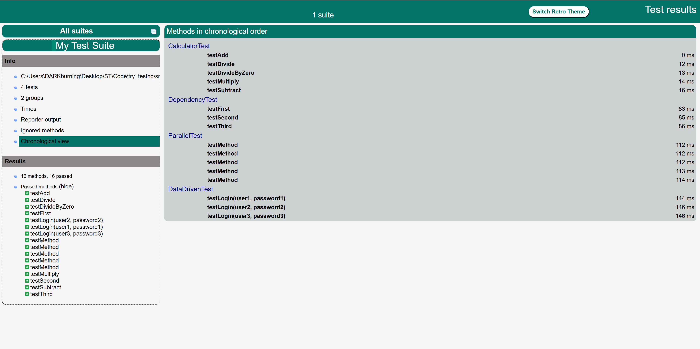

## TestNG快速上手示例
### Run Test
仓库已拥有下面的所有配置和相关文件demo，可直接运行测试：`mvn clean test`查看结果
Ps：此处仅涉及TestNG一些非常基础的功能和配置，其他的参阅文档[TestNG Documentation](https://testng.org/#_testng_documentation)

### 从零开始使用TestNG
下面讲解如何使用TestNG
#### 1. 配置maven
需要的依赖有`testng`和`opencsv`,由于使用maven运行测试需要maven插件`maven-surefire-plugin`
具体配置如下：
```xml
    <dependencies>
        <dependency>
            <groupId>org.testng</groupId>
            <artifactId>testng</artifactId>
            <version>7.9.0</version>
            <scope>test</scope>
        </dependency>

        <dependency>
            <groupId>com.opencsv</groupId>
            <artifactId>opencsv</artifactId>
            <version>5.9</version>
        </dependency>
    </dependencies>

    <build>
        <plugins>
            <plugin>
                <groupId>org.apache.maven.plugins</groupId>
                <artifactId>maven-surefire-plugin</artifactId>
                <version>2.22.2</version>
                <configuration>
                    <suiteXmlFiles>
                        <suiteXmlFile>src/test/resources/testng.xml</suiteXmlFile>
                    </suiteXmlFiles>
                </configuration>
            </plugin>
        </plugins>
    </build>
```

#### 2. 编写测试的业务逻辑
在`src/test/java`中新建java文件创建测试类即可，可根据需要给对应的方法打上注解。
本仓库提供了四个测试类：
分别演示了单元测试、数据驱动测试、依赖测试和并行化测试

#### 3. 配置testng.xml
testng.xml可以配置的选项非常多，比如说通过配置实现测试组，实现配置文件输入参数定义执行顺序等等,这里给出一个模板（由IDEA插件Create TestNG XML可以生成），其他功能可以参阅文档
```xml
<?xml version="1.0" encoding="UTF-8"?>
<!DOCTYPE suite SYSTEM "http://testng.org/testng-1.0.dtd">
<suite name="My Test Suite">
<!--    生成测试报告-->
    <listeners>
        <listener class-name="org.testng.reporters.TestHTMLReporter"/>
    </listeners>

    <test verbose="2"  name="CalculatorTest">
        <classes>
            <class name="CalculatorTest"/>
        </classes>
    </test>

    <test verbose="2"  name="DependencyTest">
        <classes>
            <class name="DependencyTest"/>
        </classes>
    </test>

    <test verbose="2"  name="ParallelTest">
        <classes>
            <class name="ParallelTest"/>
        </classes>
    </test>

    <test verbose="2"  name="DataDrivenTest">
        <classes>
            <class name="DataDrivenTest"/>
        </classes>
    </test>
</suite>
```

#### 4. maven运行测试
在项目根目录下新开一个Terminal，在Terminal中输入`mvn clean test`即可运行测试

#### 5. 获取测试报告
要获取测试报告需要在testng.xml文件中配置listener，具体如下：
```xml
    <listeners>
        <listener class-name="org.testng.reporters.TestHTMLReporter"/>
    </listeners>
```
由此，启动测试后便会生成测试报告，测试报告在`target/surefire-reports`中，用浏览器打开该目录下的`index.html`便可以查看测试报告
